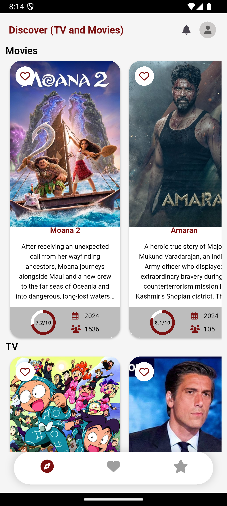
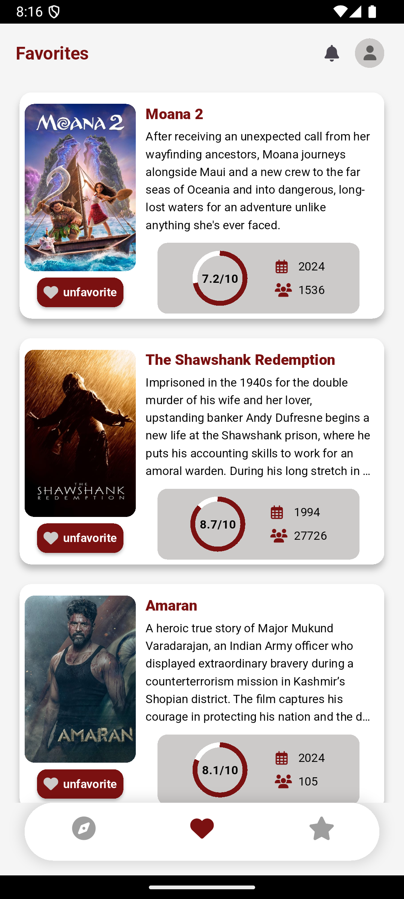
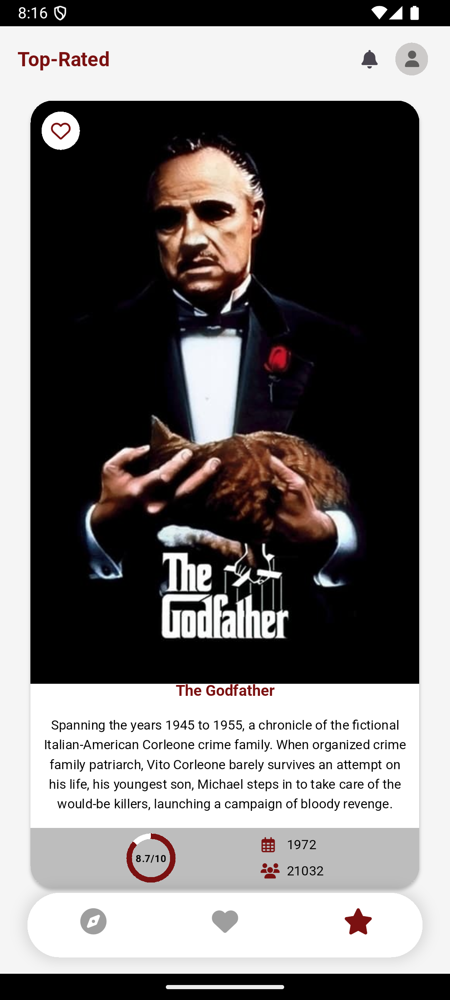

# Movie-App

## 📸 Screenshots
| Discover Screen | Favorites Screen | TopRated Screen |
|-------------|----------------|
|  |  |  |

---

## 📦 Packages Used
- [`font_awesome_flutter`](https://pub.dev/packages/font_awesome_flutter) - For access to more icons.
- [`flutter_bloc`](https://pub.dev/packages/flutter_bloc) - State management using BLoC pattern.
- [`http`](https://pub.dev/packages/http) - For making network requests.
- [`dashed_circular_progress_bar`](https://pub.dev/packages/dashed_circular_progress_bar) - For progress indicators.
- [`hive`](https://pub.dev/packages/hive) and [`hive_flutter`](https://pub.dev/packages/hive_flutter) - Local storage and caching.
- [`flutter_rating_bar`](https://pub.dev/packages/flutter_rating_bar) - For adding rating UI components.
- [`path_provider`](https://pub.dev/packages/path_provider) - Access device file system paths.
- [`lottie`](https://pub.dev/packages/lottie) - To show animated Lottie files.
- [`image_network`](https://pub.dev/packages/image_network) - Efficiently display network images with caching.

---
## 📦 Download Link (Expires in 3 days)
https://we.tl/t-ZkO1VtFfeb
